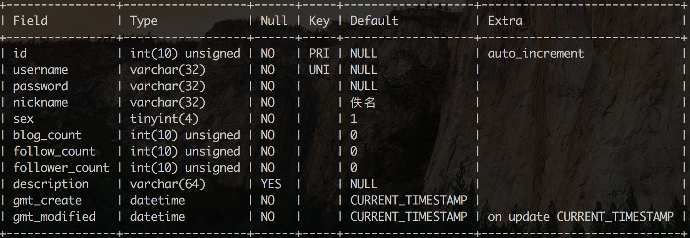
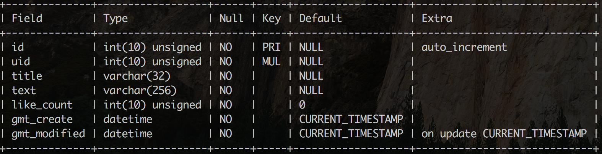
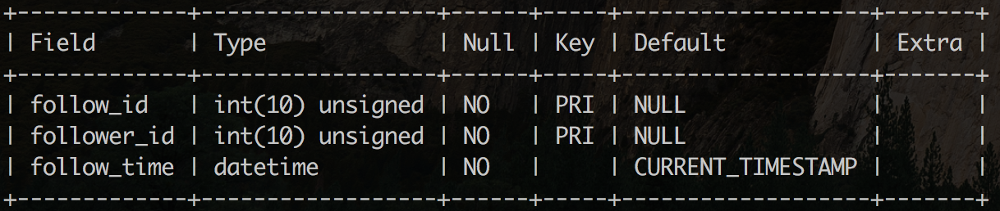
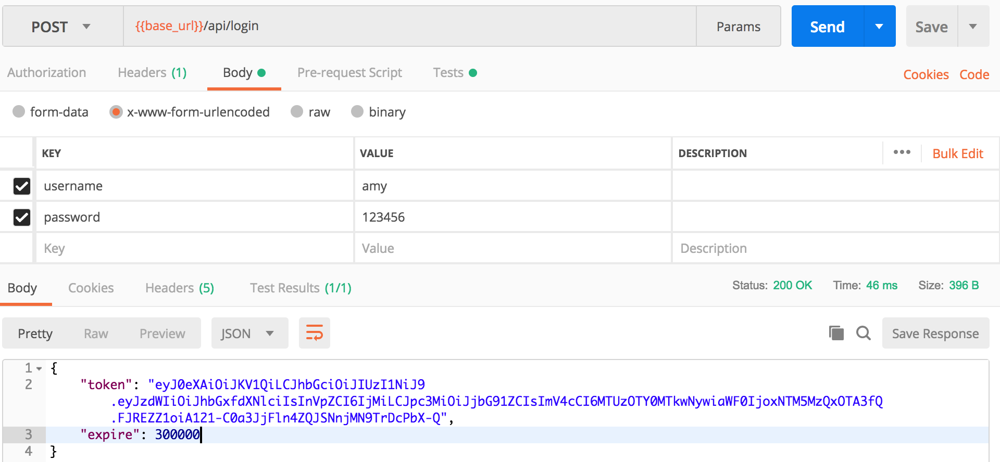
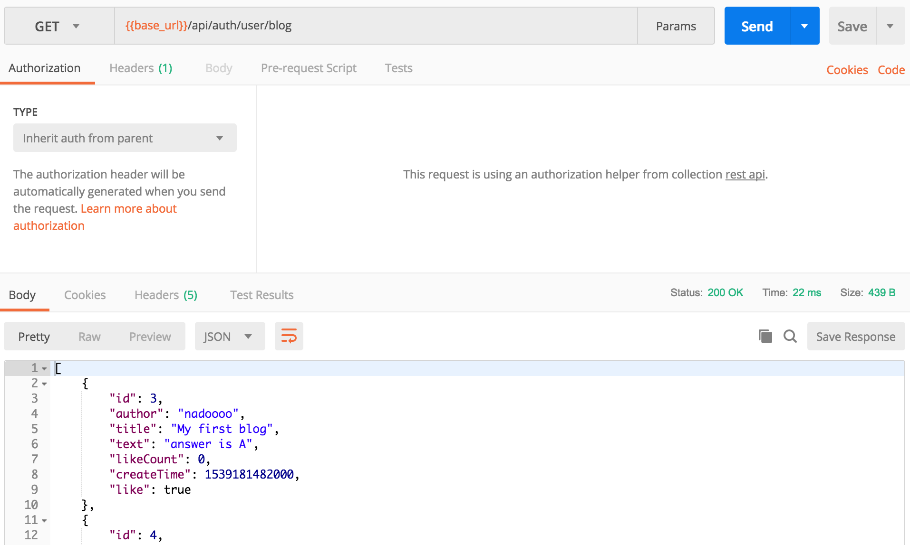

# Restful-api-based-on-SpringMVC
A demo for Spring+SpringMVC+Mybatis based Restful web server. I study Spring & SpringMVC by writing this demo.

## OverView
This demo implements a restful web server for social network based on Spring framework. It provides the following services.
- User register/login
- Follow/unfollow others
- Post/update/delete blogs
- Start/unstart a blog
- Get details for users and blogs in flexible approaches

This demo has several features as follows:
- JWT based authentication strategy
- Redis + MySQL as the persistence layer 
- Global exception handler

## Database Design
### MySQL
- user

- blog

- follow

### Redis
- Set_User2Blog_{uid} : a set of blog ids that the user started
- Set_Blog2User_{bid} : a set of user ids who started this blog

## API Design
### /api
- **Post** /register
- **Post** /login
### /api/common
- **Get** /user?uid=   
- **Get** /user/{uid}/follow?page=&count= 
- **Get** /user/{uid}/follower?page=&count=
- **Get** /user/{uid}/blog?page=&count=
- **Get** /rank/user?type=(followCount/followerCount/blogCount)
- **Get** /rank/blog?page=&count=&uid=   
- **Get** /blog?id=&uid=
### /api/auth
**interfaces follows /auth need to check the JWT(contains logined user info) in header first**
- **Get/Patch** /user/me
- **Get/Post** /user/blog
- **Get/Patch/Delete** /user/blog?id=
- **Post/Delete** /user/follow
- **Get** /user/follow/blog
- **Post/Delete** /user/blog/like

## Samples
- /login

- /common/rank/blog

- /auth/user/blog

